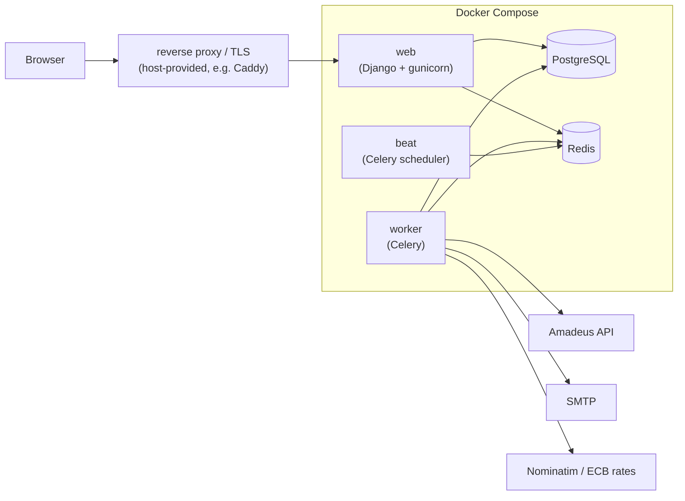

# Samferd — Architecture & Deployment

**Related docs:** [spec.md](spec.md) · [data-model.md](data-model.md) · [api.md](api.md)

## 1. Stack

| Layer | Choice | Rationale |
|---|---|---|
| Backend | **Django 5 + Django REST Framework** | auth, ORM, admin, i18n (`gettext`) built in |
| Frontend | **Django templates + HTMX** (+ Tailwind CSS) | server-rendered, dynamic tables without an SPA; mobile-first |
| Database | **PostgreSQL 16** | point type for airport/home coordinates, robustness |
| Jobs & queue | **Celery + Redis** | scheduled price refreshes, alert digests, emails, enrichment retries |
| Auth | **mozilla-django-oidc** (pluggable OIDC) + Django auth fallback | per spec §4 |
| Deployment | **Docker Compose** | single-command self-hosting |

## 2. Topology



Five containers: `web`, `worker`, `beat`, `db`, `redis`. TLS termination is left to the
host (documented examples for Caddy and Traefik).

## 3. Background jobs (Celery)

| Job | Schedule | Description |
|---|---|---|
| `refresh_event_offers` | beat, checks every 15 min | for each **active** event whose `last_fetched_at + refresh_interval` elapsed → fetch all RouteQueries, store top 3, keep one previous snapshot |
| `send_better_route_digests` | chained after refresh | alert logic per [api.md §5](api.md) |
| `enrich_bookings` | daily | retry `enrichment_status=failed/pending` bookings |
| `fetch_ecb_rates` | daily | currency display conversion |
| `send_email` | on demand | all notification emails, with retry |
| `purge_stale_offers` | daily | drop snapshots older than 2 generations, offers of past events |

The instance-level **API budget** (token bucket in Redis) is enforced inside the fare
provider client; when 80 % consumed, refresh degrades per [api.md §3](api.md).

## 4. Configuration (environment variables)

| Variable | Default | Purpose |
|---|---|---|
| `SECRET_KEY`, `ALLOWED_HOSTS`, `DATABASE_URL`, `REDIS_URL` | — | Django basics |
| `DEFAULT_LANGUAGE` | `fr` | instance default locale |
| `OIDC_RP_CLIENT_ID/SECRET`, `OIDC_OP_DISCOVERY_URL` | unset | enable OIDC when set |
| `ENABLE_PASSWORD_AUTH` | `true` | email/password fallback toggle |
| `FARE_PROVIDER` | `amadeus` | provider selection |
| `AMADEUS_CLIENT_ID/SECRET`, `AMADEUS_ENV` | —, `test` | fare API credentials |
| `API_MONTHLY_BUDGET` | `2000` | global call budget (quota guard) |
| `EMAIL_URL` (SMTP DSN), `DEFAULT_FROM_EMAIL` | — | notifications |
| `TIE_TOLERANCE_PERCENT` | `5` | better-route comparison tolerance |

## 5. Project layout (planned)

```
samferd/
├── docs/                    # this documentation
├── samferd/                 # Django project (settings, celery app)
├── apps/
│   ├── accounts/            # User, profile, OIDC, invites, GDPR
│   ├── events/              # Event, airports, participation
│   ├── carpool/             # Car, SeatRequest, cost split
│   ├── fares/               # provider abstraction, Amadeus client, RouteQuery, FlightOffer, Booking
│   └── notifications/       # emails, digests, NotificationLog
├── locale/                  # .po translation templates (fr default, en)
├── templates/ / static/
├── compose.yaml
└── Dockerfile
```

## 6. Testing & quality (targets)

- Unit tests: cost split, comparison rule (lexicographic + tolerance), invite validity,
  quota guard — pure logic, no API.
- Integration tests with **recorded Amadeus fixtures** (VCR-style); never hit the live API
  in CI.
- Amadeus `test` environment for manual end-to-end checks.
- Lint/format: ruff; CI via GitHub Actions.

## 7. Security notes

- All pages behind authentication; event data scoped to participants (object-level checks).
- Invite tokens: 128-bit random, validity computed (revoked/event-past), no enumeration.
- Secrets only via environment; no third-party trackers; CSRF/session hardening = Django
  defaults.
- Rate limiting on login and invite redemption endpoints.
