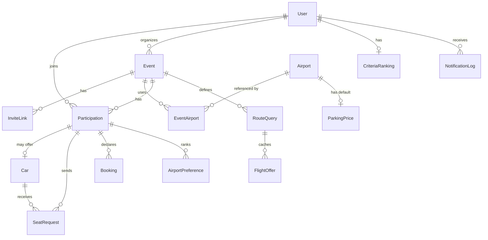

# Samferd — Data Model

**Related docs:** [spec.md](spec.md) · [api.md](api.md) · [architecture.md](architecture.md)

## 1. Entity-relationship overview

## 2. Entities

### User

| Field | Type | Notes |
|---|---|---|
| id | UUID PK | |
| email | unique | login + notifications |
| display_name | str | |
| password_hash | nullable | null for OIDC-only accounts |
| oidc_subject | nullable, unique | OIDC `sub` claim |
| home_location | nullable point | geocoded from city/postal input, raw input kept |
| language | str | default: instance default (`fr`) |
| is_site_admin | bool | |
| can_organize | bool | granted by admin |
| notify_seat_events / notify_better_route / notify_invites | bool | opt-outs, default true |
| created_at, deleted_at | | soft delete → anonymization (GDPR) |

### CriteriaRanking (1–1 with User)

| Field | Type | Notes |
|---|---|---|
| user | FK unique | |
| order | array | permutation of `[price, legs, duration, airport_pref]`, default in that order |

### Event

| Field | Type | Notes |
|---|---|---|
| id | UUID PK | |
| name, description | str/text | |
| organizer | FK User | |
| outbound_date, return_date | date | fixed dates |
| currency | ISO 4217 | default `EUR`; all event amounts use it |
| refresh_interval_hours | int | default 12 |
| manual_refresh_cooldown_minutes | int | default 60 |
| created_at | | |

Derived: `is_past = return_date < today` (no stored state; Open → Past is computed).
Derived: `is_active = not is_past and participations.count() > 0` (drives refresh jobs).

### InviteLink

| Field | Type | Notes |
|---|---|---|
| id / token | UUID, unguessable | in URL |
| event | FK | |
| created_by | FK User | organizer or admin |
| revoked_at | nullable | manual revocation |
| Validity | — | valid iff `revoked_at is null` **and** event not past. Multi-use, unlimited redemptions. |

### Airport

| Field | Type | Notes |
|---|---|---|
| iata_code | PK, 3 letters | |
| name, city, country | str | seeded from open dataset |
| location | point | for closest-first default ranking |

### ParkingPrice (per airport, admin-maintained default)

| Field | Type | Notes |
|---|---|---|
| airport | FK unique | |
| amount | decimal | |
| currency | ISO 4217 | converted for display into event currency (see api.md §4) |
| pricing_mode | enum | `per_day` \| `flat` |
| updated_by, updated_at | | |

### EventAirport

| Field | Type | Notes |
|---|---|---|
| event | FK | |
| airport | FK | |
| role | enum | `origin` \| `destination` |
| position | int | organizer's display order; default airport ranking fallback |
| added_at | | airports can be added any time; **removal only if unreferenced** by cars/bookings |

### Participation

| Field | Type | Notes |
|---|---|---|
| event, user | FK, unique together | |
| travel_mode | enum | `undecided` (default) \| `flying` \| `driving` |
| joined_at | | via invite link |

### AirportPreference (per participation)

| Field | Type | Notes |
|---|---|---|
| participation | FK | |
| airport | FK (origin EventAirport) | |
| rank | int | manual ranking; if absent → closest-first (home_location) → EventAirport.position |

### Car

| Field | Type | Notes |
|---|---|---|
| participation | FK unique | driver's participation (travel_mode=driving) |
| departure_airport | FK EventAirport(origin) | |
| total_free_seats | int ≥ 0 | excluding driver |
| note | text | departure point/time, free text |
| cost_amount | decimal nullable | flat fuel+tolls estimate, event currency |
| parking_override | decimal nullable | overrides airport default parking price |

Derived: `remaining_seats = total_free_seats − approved SeatRequests`.
Derived: `per_person_share = (cost_amount + parking) / (1 + approved riders)`.

### SeatRequest

| Field | Type | Notes |
|---|---|---|
| car | FK | |
| rider | FK Participation | |
| status | enum | `pending` → `approved` \| `declined` \| `cancelled` |
| direction | enum | `outbound` \| `return` \| `both` |
| created_at, resolved_at | | |

Constraints: request allowed only if `remaining_seats > 0`; one **approved** seat per rider
per direction; on approval, other `pending` requests of the same rider+direction are
auto-cancelled.

### RouteQuery (one per event × origin × destination × direction)

| Field | Type | Notes |
|---|---|---|
| event | FK | |
| origin, destination | FK Airport | |
| direction | enum | `outbound` \| `return` |
| last_fetched_at | datetime | staleness display + scheduling |
| last_manual_refresh_at | datetime | cooldown enforcement |

### FlightOffer (cached, top 3 per RouteQuery kept)

| Field | Type | Notes |
|---|---|---|
| route_query | FK | |
| rank | 1–3 | |
| price_amount | decimal | in event currency (requested from API) |
| legs_count | int | |
| total_duration | interval | |
| segments | JSON | per leg: carrier, flight number, dep/arr airport & time |
| booking_link | URL | provider deep link |
| provider | str | `amadeus` (abstraction, see api.md) |
| fetched_at | datetime | |

Previous generation kept (one snapshot back) for better-route comparison, then purged.

### Booking (declared by participant)

| Field | Type | Notes |
|---|---|---|
| participation | FK | |
| direction | enum | `outbound` \| `return` |
| status | enum | `searching` (default) \| `booked` \| `confirmed` |
| flight_number, flight_date | str, date | entered when `booked` |
| refundable | bool nullable | set when `booked` |
| price_paid | decimal nullable | optional, event currency; feeds cost overview & alert baseline |
| enrichment | JSON nullable | airline, times, airports from schedules API |
| enrichment_status | enum | `pending` \| `ok` \| `failed` (shown as "unverified") |

Alert eligibility: **excluded** iff `status=confirmed and refundable=false`.

### NotificationLog

| Field | Type | Notes |
|---|---|---|
| user, event | FK | |
| kind | enum | `seat_request` \| `seat_resolution` \| `better_route` \| `invite` |
| sent_at | datetime | enforces ≤ 1 better-route digest / user / event / 24 h |
| payload | JSON | audit/debug |

## 3. Key integrity rules

1. All monetary values attached to an event are in `event.currency`.
2. An invite link never outlives its event (validity is computed, no cron needed).
3. Airports referenced by a car or booking cannot be removed from an event.
4. Deleting a user (GDPR): `User` row anonymized (`display_name` → "Ancien membre",
   email/oidc/home cleared); participations, cars and seat history kept for event coherence;
   bookings kept without personal fields.
5. `FlightOffer` rows contain no personal data → cache can be purged freely.
